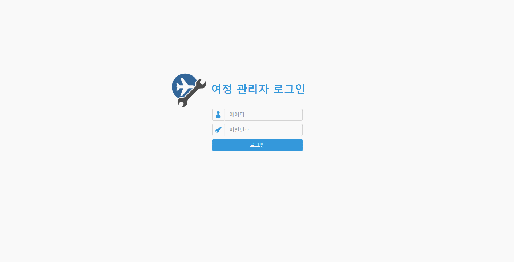

# 여행자들의 정보 ( 여정 )

> 여행자를 위한 웹 어플리케이션

    

여행자들의 스케줄 관리, 동행자 구하기 서비스, 공항 정보 등 제공  
  
  
  
  
  
## DATABASE

[데이터베이스 설계 Detail 다운로드 (xlsx파일)](https://github.com/shsewonitw/yeojeong/raw/master/docs/yeojoeng_db.xlsx)

[데이터베이스 쿼리문 보기](https://github.com/shsewonitw/yeojeong/blob/master/docs/yeojeong_sql.sql)  

## 사용 예제

#### 메인화면

#### 로그인

#### 여행등록 & 정보

#### 동행자 구하기

#### 후기 게시판

#### 공항정보

#### 자주묻는 질문

#### 관리자로그인

#### 도시 정보 등록

#### 회원관리

#### 소켓통신기반 채팅

접기/펼치기 버튼

|제목|내용|
|--|--|
|1|1|
|2|10|

